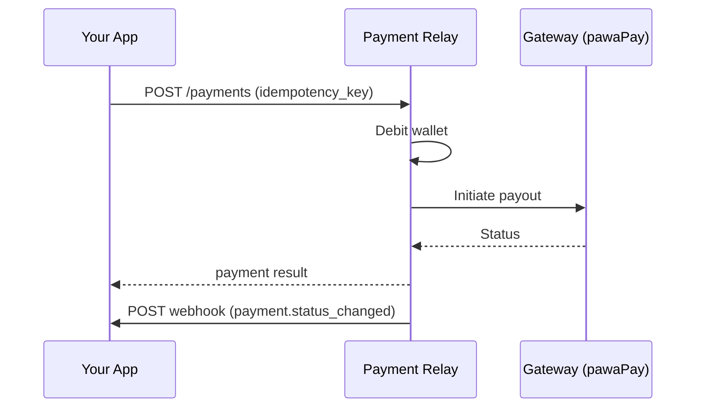

# Payments Integration

Process outbound payments (payouts) that debit a system wallet and send funds via the payment gateway.

## Flow



## Process a payment

```bash
curl -s -X POST http://localhost:8080/payments \
  -H "Content-Type: application/json" \
  -H "X-API-Key: $RELAY_API_KEY" \
  -d '{
    "system_id": "'"$SYSTEM_ID"'",
    "external_id": "SHOP_20260719_ABC12345",
    "amount": 2500,
    "currency": "ZMW",
    "country": "ZM",
    "payment_method": {
      "type": "mmo",
      "details": {
        "phone": "260763456789",
        "provider": "MTN_MOMO_ZMB"
      }
    },
    "idempotency_key": "pay-001-unique-key"
  }' | jq .
```

**TypeScript**

```typescript
const payment = await relay.payments.process({
  system_id: systemId,
  external_id: "SHOP_20260719_ABC12345",
  amount: 2500,
  currency: "ZMW",
  country: "ZM",
  payment_method: {
    type: "mmo",
    details: { phone: "260763456789", provider: "MTN_MOMO_ZMB" },
  },
  idempotency_key: crypto.randomUUID(),
});
```

**Python**

```python
payment = relay.payments.process(
    system_id=system_id,
    external_id="SHOP_20260719_ABC12345",
    amount=2500,
    currency="ZMW",
    country="ZM",
    payment_method={
        "type": "mmo",
        "details": {"phone": "260763456789", "provider": "MTN_MOMO_ZMB"},
    },
    idempotency_key=str(uuid.uuid4()),
)
```

## Idempotency

Always send a unique `idempotency_key` per logical payment attempt.

| Scenario | Result |
|----------|--------|
| Same key + same body (retry) | Returns original result (`200`) |
| Same key + different body | `409 conflict` |
| New key | New payment attempt |

Safe retry pattern: generate UUID once, store it with your order, reuse on network failures.

## External IDs

Recommended format: `{PREFIX}_{DATE}_{RANDOM}`

Example: `SHOP_20260719_ABC12345`

Relay logs a warning if the format doesn't match your system prefix but does not reject the request.

## Check payment status

```bash
curl -s http://localhost:8080/payments/$PAYMENT_ID \
  -H "X-API-Key: $RELAY_API_KEY" | jq .
```

Or list transactions:

```typescript
const txs = await relay.transactions.list(systemId, {
  external_id: "SHOP_20260719_ABC12345",
  limit: 10,
});
```

## Wallet balance

Check before payout:

```typescript
const wallets = await relay.wallets.list(systemId);
const zm = wallets.find((w) => w.country === "ZM");
if ((zm?.balance ?? 0) < amount) {
  throw new Error("Insufficient balance");
}
```

Deposits (invoice collections) credit the wallet; payouts debit it.

## Error handling

| Error | Action |
|-------|--------|
| `insufficient_balance` | Top up via invoice collection or seed |
| `country_not_enabled` | Add country to system `enabled_countries` |
| `gateway_error` | Retry with same idempotency key; check gateway status |
| `conflict` | Use a new idempotency key for a new attempt |

## Webhooks

On terminal status (`completed` or `failed`), Relay POSTs to your `webhook_url`. See [Webhooks guide](webhooks.md).
